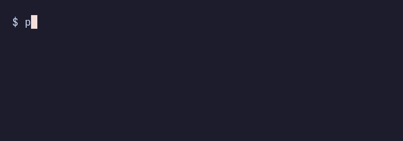

# pazzwrd

Generate strong passwords you can actually remember.

[](https://www.npmjs.com/package/pazzwrd)
[](https://www.npmjs.com/package/pazzwrd)



---

## Table of Contents

- [Install](#install)
- [Usage](#usage)
- [Interactive Mode](#interactive-mode)
- [How It Works](#how-it-works)
- [Options](#options)
- [Sponsors](#sponsors)
- [License](#license)

## Install

```sh
npm install -g pazzwrd
```

## Usage

```sh
$ pazzwrd
Brave42!Palace85#Flip29&Dry17*River
```

One command, one password. Words follow grammar patterns for better memorability. Ready to paste.

## Interactive Mode

```sh
$ pazzwrd -a
```

Full customization through a step-by-step prompt:

- **Word style** — sentence-like (grammar patterns) or random (all words from the same pool)
- **Word lists** — EFF Large (7,776 words), EFF Short 1 & 2 (1,296 each), or any combination (random mode)
- **Word count** — 3 to 7 words per password
- **Separators** — mixed (numbers+symbols), numbers only, symbols only, custom, or none
- **Capitalization** — yes, no, or random
- **Batch** — generate up to 20 passwords at once
- **Clipboard** — copy first, all, or none

## How It Works

- Default mode uses **grammar patterns** — words follow sentence-like structures (adjective-noun-verb-noun) so passwords read more naturally and are easier to remember
- Word lists are sourced from [EFF dice word lists](https://www.eff.org/dice) and POS-tagged English word lists (nouns, verbs, adjectives, adverbs)
- Randomness comes from `crypto.getRandomValues()` with rejection sampling to eliminate modulo bias
- Interactive mode shows entropy and estimated time to crack so you can compare configs
- Default config (~82 bits of entropy, ~150 million years to crack at 1 trillion guesses/sec)

## Options

```
pazzwrd        Generate a password with smart defaults
pazzwrd -a     Interactive mode with full customization
pazzwrd -h     Show help
pazzwrd -v     Show version
```

## Sponsors

pazzwrd is free, open source, and built by one person. Sponsorship funds continued development, new features, and long-term maintenance. If pazzwrd saves you time or keeps your accounts safe — consider supporting it.

<p align="center">
  <a href="https://boosty.to/melsovcozy">
    
  </a>
</p>

### Gold Sponsor

> Logo on README, link to your site, priority issue support

<p align="center">
  <a href="https://boosty.to/melsovcozy"><em>Your company here</em></a>
</p>

### Silver Sponsor

> Name on README with a link

<p align="center">
  <a href="https://boosty.to/melsovcozy"><em>Your company here</em></a>
</p>

### Backers

> Every bit helps. Thank you for supporting pazzwrd.

<p align="center">
  <a href="https://boosty.to/melsovcozy"><em>Be the first backer</em></a>
</p>

---

<p align="center">
  <strong>What sponsorship covers:</strong> bug fixes, new word lists, platform support, security audits, and keeping dependencies up to date.
</p>

## License

GPL-3.0
